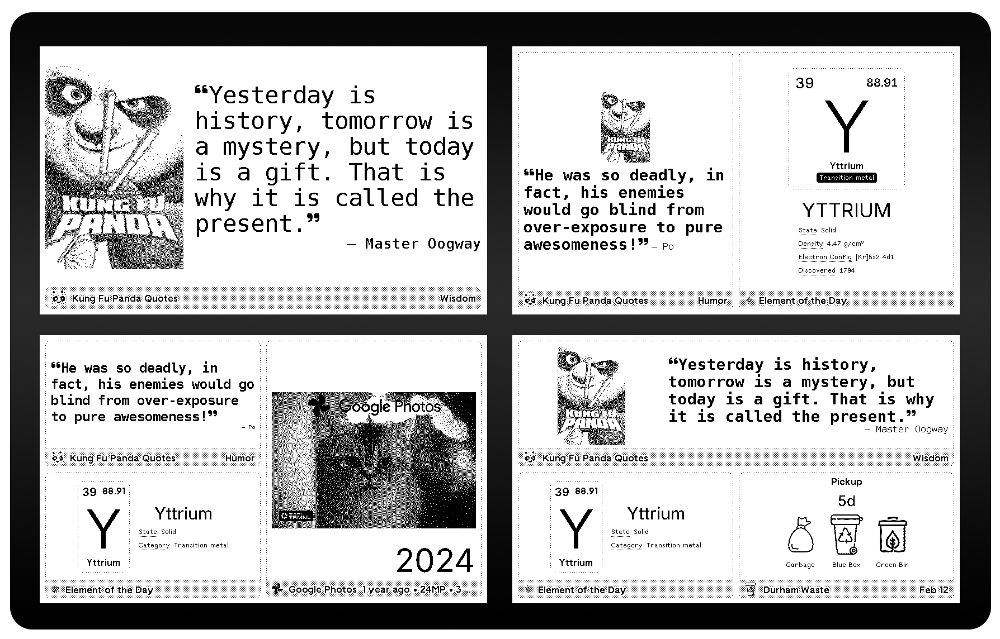
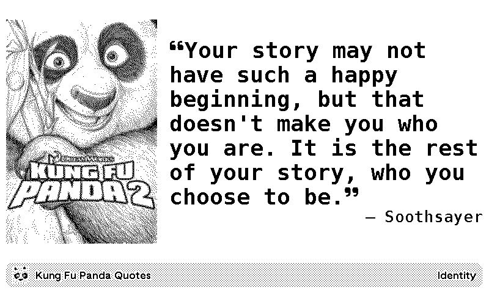
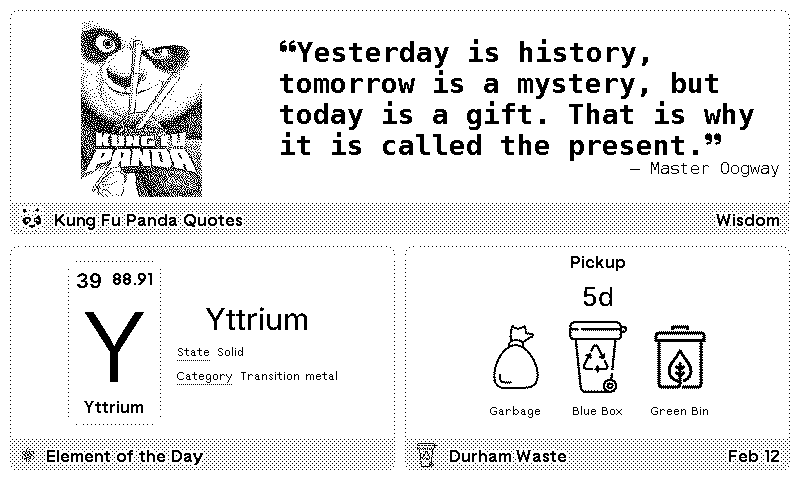
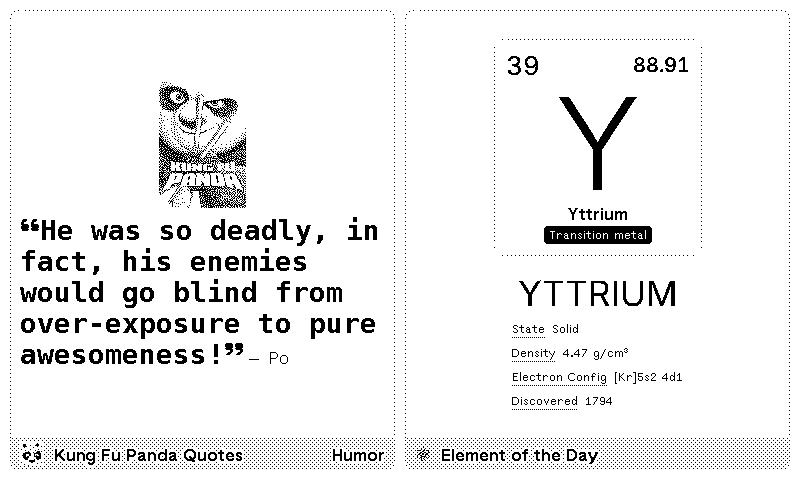
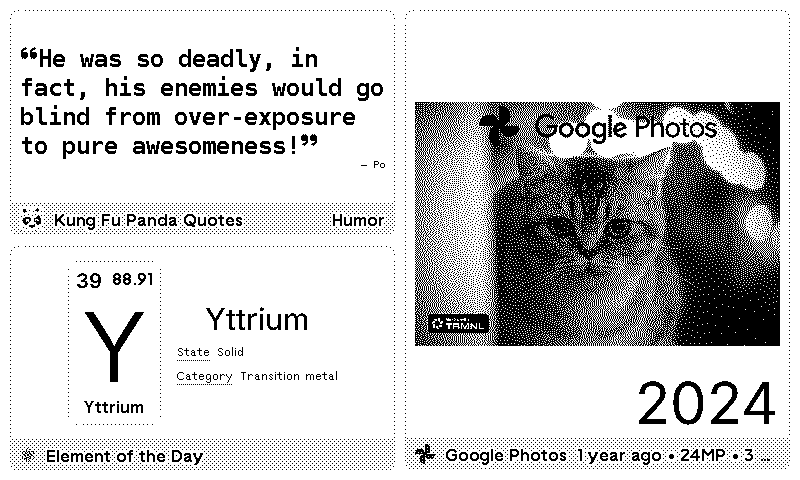
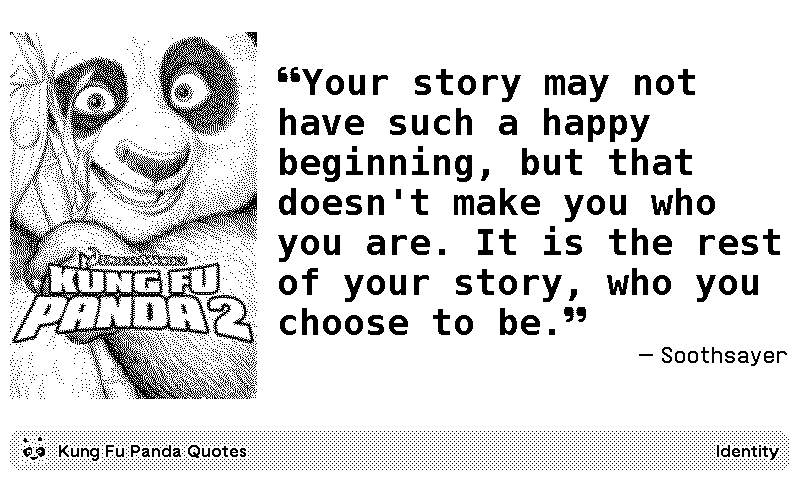

# Kung Fu Panda Quotes

Display daily wisdom and inspiration from the Kung Fu Panda films on your TRMNL device!

## About

Get inspired every day with memorable quotes from all four Kung Fu Panda movies. From Master Oogway's profound wisdom to Po's humorous confidence, let these quotes add a touch of kung fu wisdom to your daily routine.

## ✨ Features

- 🎬 **81 Quotes** from all four Kung Fu Panda movies
- 🎯 **Theme Filtering**: Choose your preferred quote style
  - Wisdom, Humor, Growth, Combat, Identity, Confidence, Iconic, Villainy
- 📜 **Smart Rotation**: Never see the same quote twice within 30 days
- 📱 **Multiple Layouts**: Looks great on any TRMNL screen size
- 🎨 **Movie Posters**: Visual themes matching each film
- ⏰ **Daily Updates**: Fresh quotes automatically delivered

## 📸 Preview

View more previews

## 🚀 Installation

<a href="https://trmnl.com/recipes/240176">
  <picture>
    <source media="(prefers-color-scheme: dark)" srcset="assets/trmnl-brand/trmnl-badge-show-it-on-dark.svg">
    <source media="(prefers-color-scheme: light)" srcset="assets/trmnl-brand/trmnl-badge-show-it-on-light.svg">
    
  </picture>
</a>

**[→ Install Kung Fu Panda Quotes Recipe](https://trmnl.com/recipes/240176)**

### Quick Setup

1. **Click the badge above** or visit [TRMNL Recipes](https://trmnl.com/recipes/240176)
2. **Tap Install** to add to your TRMNL account
3. **Configure Your Preferences**
   - **Quote Theme**: Choose your favorite style (Wisdom, Humor, Growth, etc.)
   - **Layout**: Select display format for your screen
   - **Instance Name**: (Optional) Customize the title
4. **Add to Playlist** and enjoy daily quotes!

> **Note**: After installation, you can change your theme preference anytime in plugin settings!

## 🎭 Quote Themes

| Theme | Description | Example |
|-------|-------------|---------|
| **Wisdom** | Philosophical insights | *"Yesterday is history, tomorrow is a mystery..."* |
| **Humor** | Funny moments | *"There's no charge for awesomeness!"* |
| **Growth** | Personal development | *"If you only do what you can do, you will never be more than you are now."* |
| **Combat** | Action & fighting | *"Finally! A worthy opponent!"* |
| **Identity** | Self-discovery | *"Who are you, panda?"* |
| **Confidence** | Self-belief | *"I'm THE big fat panda!"* |
| **Iconic** | Memorable catchphrases | *"Skadoosh."* |
| **Villainy** | Villain wisdom | *"The dead exist in the past..."* |

## 🛠️ For Developers

Want to customize this plugin or contribute? See our technical documentation:

- [Technical Guide](assets/docs/TECHNICAL_GUIDE.md) - Deployment, development, and API details
- [Theme Filtering](assets/docs/THEME_FILTERING_IMPLEMENTATION.md) - How theme filtering works
- [Contributing Guidelines](CONTRIBUTING.md) - How to contribute quotes or code

## 📄 License

This plugin is provided under the MIT License - see [LICENSE](LICENSE) for details.

**Note**: Quotes are from the Kung Fu Panda film franchise (DreamWorks Animation). This is a fan project and not officially affiliated with DreamWorks or TRMNL.

## 🙏 Credits

- **Quotes**: Kung Fu Panda films (DreamWorks Animation)
- **Plugin Framework**: [TRMNL](https://usetrmnl.com)
- **Plugin Author**: Community Contributors

## 🤝 Contributing

Love Kung Fu Panda? Help us expand the quote collection!

- Found a great quote we missed? [Submit it here](CONTRIBUTING.md)
- See a bug? [Open an issue](https://github.com/hossain-khan/trmnl-kung-fu-panda-quotes/issues)
- Want to improve layouts? [Technical Guide](assets/docs/TECHNICAL_GUIDE.md)

---

**Daily Wisdom, Delivered.** 🐼

*"Yesterday is history, tomorrow is a mystery, but today is a gift. That is why it is called the present."*

